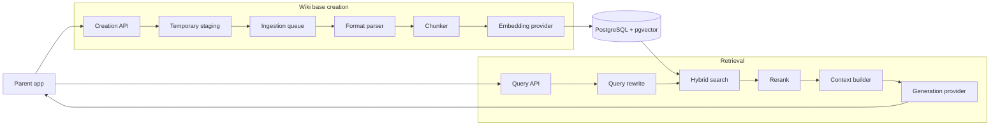

# Wiki Base implementation plan

## 1. Purpose

Wiki Base is a self-hosted service for creating immutable, searchable collections of vectorized documents and answering questions from those collections with citations.

A parent application uploads documents while creating a wiki base. Wiki Base parses, chunks, embeds, and indexes the documents asynchronously. The parent application later sends a wiki base ID, a question, and any relevant conversation history. Wiki Base retrieves evidence from that wiki base and uses a configured LLM provider to produce a cited answer.

This document describes the initial release. It favors a modular monolith, explicit interfaces, and a small operational footprint over premature distribution or scale-specific optimization.

## 2. Decisions made

- Python 3.12 and FastAPI will be used for the HTTP service.
- PostgreSQL with `pgvector` will store metadata, chunks, embeddings, and lexical-search data.
- PostgreSQL is assumed to run locally and the service is self-hosted.
- Database access will use parameterized raw SQL. There is no ORM or migration framework in the initial release.
- `sql/schema.sql` will be the authoritative, idempotent initial schema.
- A wiki base is created with a name and one or more uploaded document blobs.
- Creation is asynchronous after the request has uploaded and staged all file bytes.
- Original documents are not stored durably. They are staged temporarily for ingestion and deleted after processing or failure.
- Document names and source-location metadata are retained for citations.
- The initial accepted formats are PDF, DOCX, and PPTX.
- Docling will parse and normalize all supported formats.
- Each file type will have its own parser class, selected through a parser registry.
- Docling's structure-aware chunking will be the initial chunking implementation.
- Embedding, generation, and reranking providers will be replaceable behind internal interfaces.
- Wiki bases are immutable after creation. Documents cannot be added, replaced, or removed individually.
- Deleting an entire wiki base remains supported.
- The parent application owns authentication, authorization, tenant concerns, original document storage, and conversation persistence.
- Wiki Base will not authenticate requests in the initial release and assumes one database tenant.
- Conversation history is supplied with each query and is not persisted by Wiki Base.
- Retrieval will be scoped strictly by wiki base ID and will return citations derived from stored chunk metadata.
- Initial retrieval is designed for hybrid lexical and vector search, followed by optional reranking.
- Initial scale limits and scale-specific architecture are out of scope.

## 3. Scope

### Included

- Creating an immutable wiki base from multipart document uploads
- Temporary, bounded file staging
- Asynchronous ingestion with visible status
- PDF, DOCX, and PPTX parsing
- Structure-aware chunking
- Provider-neutral embedding generation
- PostgreSQL vector and lexical indexing
- Conversation-aware query rewriting using parent-supplied history
- Hybrid retrieval, result fusion, optional reranking, and context construction
- LLM answer generation
- Page-, slide-, or section-aware citations
- Whole-wiki-base deletion
- Health, readiness, and capability reporting
- Unit, integration, end-to-end, and retrieval evaluation tests

### Not included

- Authentication or authorization
- Multi-tenant data isolation
- Durable storage of original files
- Persisting conversations or messages
- Adding, removing, updating, or versioning documents after creation
- Legacy `.ppt` support
- A user interface
- Managed cloud infrastructure
- Scale-specific sharding, replication, or distributed ingestion
- Guarantees for unsupported or encrypted documents

## 4. High-level architecture

The initial system is a modular monolith with a separate worker process. The API and worker share application code and PostgreSQL, but run as distinct processes so document ingestion cannot block request handling.



## 5. Creation flow steps

### 5.1 Parent app

**Purpose:** Own the end-user workflow and call Wiki Base on behalf of the user.

**Primary responsibilities:**

- Upload a name and one or more document blobs using multipart form data.
- Retain the returned wiki base ID for future requests.
- Poll wiki-base status until it becomes queryable.
- Display document-level failures and citations returned by Wiki Base.

**Decisions:** The parent application owns authentication, authorization, tenant mapping, durable originals, and conversation persistence.

**Out of scope for Wiki Base:** User management, permission checks, the parent application's document IDs, and user-interface behavior.

### 5.2 Creation API

**Purpose:** Validate and accept a complete, immutable wiki-base manifest.

**Primary responsibilities:**

- Validate the wiki-base name and presence of at least one document.
- Validate extension, declared media type, detected file signature, per-file size, and request limits.
- Stream uploads to temporary files rather than reading entire files into memory.
- Insert wiki-base, document, and ingestion-job records atomically after staging succeeds.
- Enqueue ingestion and return the wiki base ID with `queued` status.
- Clean up staged files if request validation or database creation fails.

**Decisions:** The response is asynchronous with respect to parsing and vectorization, but the request must remain open while bytes are uploaded and safely staged. The manifest cannot change after a successful creation response.

**Out of scope:** Parsing documents, generating embeddings, waiting for ingestion to complete, or storing originals durably.

### 5.3 Temporary staging

**Purpose:** Make uploaded blobs available to a background worker without treating Wiki Base as a document store.

**Primary responsibilities:**

- Store files under generated, non-user-controlled paths.
- Apply restrictive filesystem permissions and bounded size limits.
- Associate staged paths with ingestion jobs rather than exposing them publicly.
- Delete each file after successful ingestion or terminal failure.
- Run expiration cleanup for orphaned files left by crashes.

**Decisions:** Staging is transient operational state. A document name is kept in PostgreSQL, but the blob is not retained after ingestion.

**Out of scope:** Long-term recovery of originals, file downloads, document previews, or synchronization with parent storage.

### 5.4 Ingestion queue

**Purpose:** Decouple expensive document processing from the creation request.

**Primary responsibilities:**

- Schedule one wiki-base ingestion job and track document progress.
- Provide retryable, idempotent task execution.
- Prevent concurrent workers from processing the same document.
- Record attempts, failures, timestamps, and terminal status.
- Transition the wiki base through `queued`, `processing`, `ready`, `partially_failed`, or `failed`.

**Decisions:** A `partially_failed` wiki base is queryable using successfully indexed documents, while its failed documents remain visible in status responses. The concrete queue library is intentionally not fixed yet and must sit behind a small queue interface.

**Out of scope:** Distributed scheduling at very large scale and workflow orchestration beyond ingestion and cleanup.

### 5.5 Format parser

**Purpose:** Convert each supported file into a consistent structured representation while preserving citation provenance.

**Primary responsibilities:**

- Select `PdfDocumentParser`, `DocxDocumentParser`, or `PptxDocumentParser` through a registry.
- Configure and invoke the shared Docling converter.
- Normalize format-specific Docling output into an internal `ParsedDocument`.
- Preserve pages for PDF, slides for PPTX, and headings/sections for DOCX.
- Produce clear format-specific parsing failures.

**Decisions:** There is one parser class per file type. Shared Docling initialization belongs in a composed adapter rather than a large inheritance hierarchy. Adding or deprecating a format is an explicit registry change. Parser type and version are stored with document metadata.

**Out of scope:** Chunk sizing, embedding, retrieval, and handling unsupported formats. OCR can be configured for PDFs, but OCR quality tuning is not an initial project goal.

### 5.6 Chunker

**Purpose:** Turn a structured document into retrieval-sized units without unnecessarily losing document structure.

**Primary responsibilities:**

- Use Docling's structure-aware `HybridChunker` initially.
- Align the chunk token limit with the configured embedding model's tokenizer.
- Preserve headings, captions, page or slide references, ordering, and document identity.
- Produce clean display text and contextualized embedding text.
- Give each chunk a stable identifier and positional metadata.

**Decisions:** Contextualized text is embedded, while clean source text is retained for excerpts and citations. Initial chunk targets will be approximately 400–700 tokens and adjusted through evaluation rather than treated as a permanent constant.

**Out of scope:** Calling an embedding model, storing chunks, or deciding which chunks answer a later question.

### 5.7 Embedding provider

**Purpose:** Convert contextualized chunk text into vectors.

**Primary responsibilities:**

- Expose a provider-neutral batch embedding interface.
- Enforce model token limits and expected vector dimensions.
- Batch requests and report provider errors in a retryable form.
- Expose model, tokenizer, and dimension metadata for persistence.
- Provide a deterministic fake implementation for tests.

**Decisions:** Docling does not create embeddings. Provider SDKs must stay behind the embedding interface. An index records the embedding model and dimension so incompatible query vectors cannot be used silently.

**Out of scope:** Parsing, chunking, vector search, or choosing an embedding vendor inside business logic.

### 5.8 PostgreSQL and pgvector

**Purpose:** Persist all durable Wiki Base state except original document blobs.

**Primary responsibilities:**

- Store wiki bases, document manifests, ingestion jobs, chunks, embeddings, and citation metadata.
- Enforce ownership relationships and immutable-manifest constraints.
- Index embeddings with `pgvector` and text for lexical search.
- Support transactionally consistent status changes and deletion.
- Scope every retrieval query by wiki base ID.

**Decisions:** Database access uses parameterized raw queries grouped by resource. `sql/schema.sql` creates the extension, tables, constraints, and indexes. The schema is initialized explicitly rather than silently during API startup.

**Out of scope:** Original blobs, conversations, ORM models, migrations in the initial release, and multi-tenant authorization policies.

## 6. Retrieval flow steps

### 6.1 Query API

**Purpose:** Accept a question for an existing, queryable wiki base and return an evidence-based answer.

**Primary responsibilities:**

- Validate the wiki base ID, question, history, filters, and response mode.
- Reject missing, deleted, queued, processing, or fully failed wiki bases.
- Pass parent-supplied conversation history into the retrieval pipeline.
- Return an answer, citations, and useful retrieval metadata.
- Support non-streaming first and allow Server-Sent Events to be added without changing the core pipeline.

**Decisions:** Wiki Base is stateless with respect to conversations. Conversation history is request data and is not persisted.

**Out of scope:** Authenticating the caller, loading conversation history from another service, or guaranteeing that arbitrary history supplied by a caller is trustworthy.

### 6.2 Query rewrite

**Purpose:** Convert a context-dependent user message into a standalone retrieval query.

**Primary responsibilities:**

- Use the current question and relevant recent history.
- Resolve references such as “that policy” where possible.
- Retain the original question for final answer generation.
- Fall back to the original question if rewriting fails.

**Decisions:** Rewriting uses the configured generation provider through its interface. It is primarily a retrieval aid and must not answer the question itself.

**Out of scope:** Persisting or summarizing the conversation permanently, inventing missing user intent, or modifying stored content.

### 6.3 Hybrid search

**Purpose:** Find a broad set of relevant evidence using complementary retrieval methods.

**Primary responsibilities:**

- Embed the rewritten query using the same compatible embedding configuration as the indexed chunks.
- Run vector similarity search scoped to the wiki base.
- Run PostgreSQL lexical search scoped to the same wiki base.
- Fuse both ranked result sets and remove duplicates.
- Apply supported metadata filters.

**Decisions:** Hybrid retrieval is preferred over vector-only retrieval because names, exact phrases, acronyms, and identifiers often benefit from lexical matching. Retrieval must never cross wiki-base boundaries.

**Out of scope:** Generating prose answers or trusting one similarity score as proof that evidence is sufficient.

### 6.4 Rerank

**Purpose:** Improve the ordering of a small candidate set before building LLM context.

**Primary responsibilities:**

- Score candidates against the original or rewritten question.
- Return a stable ranked list with provenance intact.
- Support a passthrough implementation when no reranking provider is configured.
- Apply configurable candidate and output limits.

**Decisions:** Reranking is provider-neutral and optional operationally, but it has an explicit stage so it can be enabled and evaluated without restructuring retrieval.

**Out of scope:** Parsing documents, changing chunk content, or producing final citations independently of stored provenance.

### 6.5 Context builder

**Purpose:** Assemble the best evidence into a bounded and clearly attributed prompt context.

**Primary responsibilities:**

- Select chunks within the generation model's token budget.
- Remove redundant content and optionally include useful neighboring chunks.
- Label every context item with an internal source identifier.
- Preserve document name, page, slide, section, and chunk identifiers.
- Detect when retrieved evidence is too weak to support an answer.

**Decisions:** Retrieved document content is untrusted data and is delimited as evidence, not instructions. The system should prefer an explicit insufficient-evidence response over unsupported claims.

**Out of scope:** Fetching original documents, expanding beyond the immutable index, or allowing document text to override system behavior.

### 6.6 Generation provider

**Purpose:** Produce a useful answer grounded in the assembled context and conversation.

**Primary responsibilities:**

- Expose provider-neutral generation and, later, streaming interfaces.
- Receive system instructions, relevant history, the current question, and bounded evidence.
- Produce a structured answer referencing allowed internal source identifiers.
- Abstain when the supplied evidence is insufficient.
- Return provider and usage metadata needed for observability.

**Decisions:** Provider-specific SDK objects do not escape this layer. The model proposes source references, but the service resolves final citation fields from stored chunk metadata rather than accepting model-generated filenames or page numbers.

**Out of scope:** General web knowledge retrieval, durable conversation memory, or using uncited model knowledge as evidence.

### 6.7 Answer returned to parent

**Purpose:** Give the parent application a displayable result with verifiable provenance.

**Primary responsibilities:**

- Return answer text and zero or more structured citations.
- Include document ID, document name, chunk ID, excerpt, and page, slide, or section when available.
- Indicate insufficient evidence or partial wiki-base ingestion where applicable.
- Return stable error codes for invalid state and provider failures.

**Decisions:** Citations are derived from retrieved database records. The parent application decides how to render citations and how to store the resulting conversation.

**Out of scope:** Serving the original cited file, controlling the parent's UI, or retaining the answer as conversation history.

## 7. API endpoints

The exact response fields may evolve during implementation, but the resource boundaries and behaviors below form the initial contract.

### `POST /wiki-bases`

Create an immutable wiki base and stage its documents.

- Content type: `multipart/form-data`
- Fields: `name` and repeated `documents` file parts
- Returns: `202 Accepted`
- Response: wiki base ID, name, overall status, and document IDs/names/statuses
- Fails atomically if upload staging or manifest creation cannot complete

Example response:

```json
{
  "id": "0190f3a0-7d83-7a41-a27c-b7314f5ae705",
  "name": "Engineering Handbook",
  "status": "queued",
  "documents": [
    {
      "id": "0190f3a0-b096-7af5-8392-cc61de46f6de",
      "name": "policy.pdf",
      "status": "queued"
    }
  ]
}
```

### `GET /wiki-bases/{wiki_base_id}`

Return wiki-base metadata, aggregate ingestion status, progress counts, and any summary failure information.

### `GET /wiki-bases/{wiki_base_id}/documents`

Return the immutable document manifest with each document's status, detected type, citation metadata summary, and sanitized ingestion error if present.

### `DELETE /wiki-bases/{wiki_base_id}`

Delete the wiki base and all derived documents, jobs, chunks, and embeddings. Any staged files associated with active jobs must also be scheduled for cleanup.

- Returns: `204 No Content`
- Individual document deletion is deliberately unsupported

### `GET /querychunks`

Retrieve the most similar chunks from a ready or partially failed wiki base. This remains a
useful retrieval-debugging endpoint and does not perform answer generation.

Query parameters: `wiki_base_id`, `question`, and optional `limit` (default 5, maximum 20).

Example response:

```json
{
  "wiki_base_id": "0190f3a0-7d83-7a41-a27c-b7314f5ae705",
  "question": "Does this policy apply to contractors?",
  "chunks": [
    {
      "id": "0190f3a1-a0ee-77ac-a76b-fb191cb0f8a0",
      "document_id": "0190f3a0-b096-7af5-8392-cc61de46f6de",
      "document_name": "policy.pdf",
      "content": "The remote-work policy applies to employees and eligible contractors...",
      "score": 0.8472,
      "page": 7,
      "slide": null,
      "section": "Eligibility",
      "heading": "Who can work remotely"
    }
  ]
}
```

### `POST /query`

Retrieve relevant chunks and generate a grounded answer with Ollama. The request contains
`wiki_base_id`, `question`, optional parent-supplied `history`, and an optional retrieval
`limit`. The initial local generation model is configurable and defaults to `gemma3:270m`.

The response contains the answer plus citations resolved from retrieved database chunks.
Model-provided source IDs that do not correspond to supplied chunks are discarded. Query
rewriting, streaming, hybrid search, and reranking remain later improvements.

### `GET /capabilities`

Return enabled document formats and relevant configured capabilities, such as reranking and streaming availability. Initially this reports PDF, DOCX, and PPTX.

### `GET /health`

Return liveness only. It should not require all dependencies to be available.

### `GET /ready`

Return readiness based on required dependencies such as PostgreSQL, the queue, temporary staging, and configured model providers.

## 8. Status model

Wiki bases and documents use explicit ingestion states:

```text
queued -> processing -> ready
                    -> partially_failed  (wiki base only)
                    -> failed
```

- `queued`: accepted and awaiting a worker.
- `processing`: at least one document is being parsed, chunked, or embedded.
- `ready`: every document was indexed successfully.
- `partially_failed`: at least one document succeeded and at least one failed; successful content is queryable.
- `failed`: no usable indexed content exists.

Deletion is a resource operation rather than a long-lived public status in the initial release. Internal cleanup may continue briefly after the API stops exposing the resource.

## 9. Data model

### `wiki_bases`

- UUID primary key
- Name
- Status
- Embedding configuration snapshot
- Retrieval/generation configuration snapshot where needed for compatibility
- Created, started, and completed timestamps

### `documents`

- UUID primary key and wiki base foreign key
- Original document name
- Detected media type and extension
- Content checksum
- Status and sanitized error information
- Parser type and version
- Page or slide count when available
- Created, started, and completed timestamps

The temporary path is operational job state and must not be returned by the API. It should be cleared after cleanup.

### `ingestion_jobs`

- UUID primary key
- Wiki base and document association
- Status, attempts, lease information, and progress
- Temporary staging reference
- Error code and sanitized error detail
- Queued, started, heartbeat, and completed timestamps

### `chunks`

- UUID primary key
- Wiki base and document foreign keys
- Clean source text
- Contextualized embedding text if needed for diagnostics
- Embedding vector
- Token count and ordinal position
- Page, slide, section, heading, and caption metadata as applicable
- Full-text-search representation
- Embedding model, dimension, parser, and chunker version metadata

## 10. Proposed project structure

Only directories needed by the current milestone should be created; the tree below describes intended ownership rather than requiring empty placeholder files.

```text
wiki-base/
├── pyproject.toml
├── README.md
├── PLAN.md
├── .env.example
├── docker-compose.yml
│
├── src/
│   └── wiki_base/
│       ├── __init__.py
│       ├── main.py
│       ├── api/
│       │   ├── dependencies.py
│       │   ├── errors.py
│       │   └── routes/
│       │       ├── health.py
│       │       ├── capabilities.py
│       │       ├── wiki_bases.py
│       │       └── queries.py
│       ├── schemas/
│       │   ├── wiki_bases.py
│       │   ├── documents.py
│       │   ├── ingestion.py
│       │   └── queries.py
│       ├── services/
│       │   ├── wiki_bases.py
│       │   ├── ingestion.py
│       │   └── querying.py
│       ├── database/
│       │   ├── connection.py
│       │   ├── setup.py
│       │   ├── records.py
│       │   └── queries/
│       │       ├── wiki_bases.py
│       │       ├── documents.py
│       │       ├── chunks.py
│       │       └── ingestion_jobs.py
│       ├── ingestion/
│       │   ├── pipeline.py
│       │   ├── models.py
│       │   ├── staging.py
│       │   ├── cleanup.py
│       │   ├── parsers/
│       │   │   ├── base.py
│       │   │   ├── registry.py
│       │   │   ├── docling_converter.py
│       │   │   ├── pdf.py
│       │   │   ├── docx.py
│       │   │   └── pptx.py
│       │   └── chunking/
│       │       ├── base.py
│       │       └── docling.py
│       ├── retrieval/
│       │   ├── pipeline.py
│       │   ├── models.py
│       │   ├── query_rewriter.py
│       │   ├── search.py
│       │   ├── fusion.py
│       │   ├── reranker.py
│       │   ├── context_builder.py
│       │   └── citations.py
│       ├── providers/
│       │   ├── embeddings/
│       │   │   ├── base.py
│       │   │   ├── factory.py
│       │   │   └── fake.py
│       │   ├── generation/
│       │   │   ├── base.py
│       │   │   ├── factory.py
│       │   │   └── fake.py
│       │   └── reranking/
│       │       ├── base.py
│       │       └── passthrough.py
│       ├── queue/
│       │   ├── base.py
│       │   └── tasks.py
│       ├── workers/
│       │   ├── main.py
│       │   ├── ingestion.py
│       │   └── cleanup.py
│       └── config/
│           ├── settings.py
│           └── logging.py
│
├── sql/
│   └── schema.sql
├── tests/
│   ├── unit/
│   ├── integration/
│   ├── e2e/
│   ├── fixtures/documents/
│   └── conftest.py
└── scripts/
    ├── initialize_database.py
    ├── ingest_sample.py
    └── evaluate_retrieval.py
```

### Dependency direction

```text
API -> services -> ingestion/retrieval -> providers and database
workers -> services -> ingestion -> providers and database
```

- API routes handle HTTP translation, not SQL or Docling calls.
- Services coordinate use cases and transaction boundaries.
- Database query modules contain parameterized SQL and return typed database records.
- Ingestion and retrieval own their respective pipelines.
- Provider-specific SDKs remain inside provider adapters.
- Workers invoke services; they do not duplicate ingestion rules.

## 11. Reliability and safety

- Stream uploads and enforce configurable file-count, per-file, and total-request limits.
- Detect actual file type and reject extension/media-type/signature mismatches.
- Never construct staging paths from untrusted filenames.
- Make ingestion retryable and idempotent using job state, checksums, leases, and database constraints.
- Use transactions for manifest creation and coherent status changes.
- Run periodic cleanup for expired staging files and abandoned job leases.
- Treat parsed document text as untrusted prompt input.
- Parameterize every SQL statement.
- Scope every chunk lookup and deletion by wiki base ID.
- Sanitize provider and parser failures before exposing them through the API.
- Record structured logs, request/job correlation IDs, durations, token usage, and provider failures.
- Delete staged data after both successful and terminally failed processing.

## 12. Testing and evaluation

### Unit tests

- Parser registry resolution and format rejection
- Shared parser contract for PDF, DOCX, and PPTX implementations
- Chunk metadata and token-limit behavior
- Status transition rules
- Query fusion, context selection, and citation resolution
- Provider adapters using fakes

### Integration tests

- Raw SQL query functions against PostgreSQL with `pgvector`
- Schema initialization and constraints
- Multipart staging and cleanup
- Worker retries and idempotency
- Docling conversion using representative fixture documents

### End-to-end tests

- Upload documents, poll until ready, ask a question, and verify citation provenance
- Mixed successful and failed documents leading to `partially_failed`
- Whole-wiki-base deletion and derived-data cleanup
- Follow-up question using supplied history
- Insufficient-evidence response

### Golden document fixtures

- Text PDF and scanned PDF
- Multi-column PDF
- PDF with tables
- DOCX with nested headings and tables
- PPTX with titles, text boxes, tables, and speaker notes where supported

### Retrieval evaluation

Maintain a small set of questions with expected source chunks and acceptable answer characteristics. Track retrieval recall at K, ranking quality, citation correctness, groundedness, abstention behavior, latency, and provider cost. Chunk sizing and retrieval settings should change only with evidence from this suite.

## 13. Delivery milestones

1. **Foundation:** source layout, configuration, FastAPI entry point, PostgreSQL connection, `schema.sql`, health checks, and local containers.
2. **Creation:** wiki-base records, document manifest, multipart endpoint, bounded staging, status endpoints, and deletion.
3. **Ingestion:** queue interface, worker, status transitions, cleanup, parser registry, and Docling parsers.
4. **Indexing:** Docling chunking, embedding interface, batching, chunk persistence, and pgvector indexes.
5. **Baseline retrieval:** vector search, context construction, generation interface, and database-backed citations.
6. **Advanced retrieval:** conversation-aware rewrite, lexical search, fusion, reranking, neighboring context, and abstention.
7. **Hardening:** retries, idempotency, limits, observability, error contracts, and failure-path tests.
8. **Evaluation:** golden documents, retrieval regression suite, and configuration tuning.

## 14. Deferred decisions

These choices are deliberately left open until their milestone:

- Concrete background queue and broker implementation
- First real embedding, generation, and reranking adapters
- Exact embedding model, vector dimension, and PostgreSQL vector index type
- Exact chunk token target after evaluation
- OCR engine and language configuration
- Whether Server-Sent Events are required in the initial query endpoint
- Maximum file count, file size, total request size, history size, and query rate
- Retention duration for terminal job metadata and operational logs

The interfaces and database metadata must make these choices configurable without changing the public resource model.
