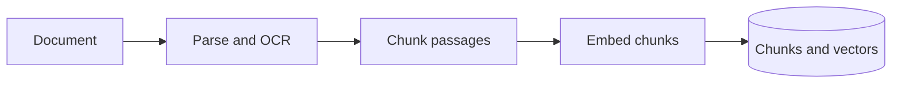
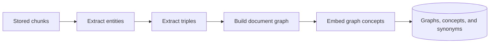
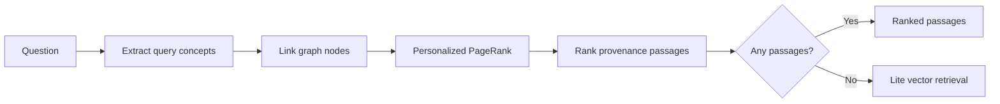
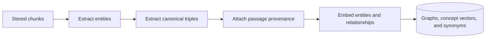
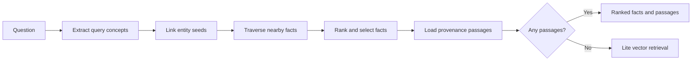

# Wiki Base

A self-hosted service for creating immutable, vectorized document collections and
answering questions from them with citations.

## Development

Requirements:

- Python 3.12+
- `uv`
- Docker with Compose

Create local configuration and start PostgreSQL:

```bash
cp .env.example .env
docker compose up -d postgres
uv sync
uv run wiki-base-init-db
uv run uvicorn wiki_base.main:app --reload
```

In a second terminal, start the single ingestion worker:

```bash
uv run wiki-base-ingestion-worker
```

Start the graph indexing worker in another terminal:

```bash
uv run wiki-base-graph-worker
```

Structured extraction and final answers can use different providers and models:

```env
WIKI_BASE_EXTRACTION_PROVIDER=groq
WIKI_BASE_EXTRACTION_MODEL=openai/gpt-oss-20b
WIKI_BASE_GROQ_API_KEY=gsk_your_key_here
WIKI_BASE_ANSWER_GENERATION_PROVIDER=ollama
WIKI_BASE_ANSWER_GENERATION_MODEL=gemma3:270m
```

Both generation roles also support a local llama.cpp server through its
OpenAI-compatible API:

```env
WIKI_BASE_ANSWER_GENERATION_PROVIDER=llama-cpp
WIKI_BASE_ANSWER_GENERATION_MODEL=local-model
WIKI_BASE_LLAMA_CPP_URL=http://127.0.0.1:8080
WIKI_BASE_LLAMA_CPP_TIMEOUT_SECONDS=120
```

Embeddings can use Ollama, a llama.cpp embedding server, or another OpenAI-compatible API:

```env
WIKI_BASE_EMBEDDING_PROVIDER=llama-cpp
WIKI_BASE_EMBEDDING_MODEL=bge-m3
WIKI_BASE_EMBEDDING_DIMENSIONS=1024
WIKI_BASE_LLAMA_CPP_URL=http://127.0.0.1:8080
```

For another compatible service, select `openai-compatible` and configure
`WIKI_BASE_EMBEDDING_BASE_URL` plus the optional `WIKI_BASE_EMBEDDING_API_KEY`.

The extraction model handles graph indexing and query-concept extraction. The answer model
is used only after retrieval has selected supporting chunks. Groq defaults stay below the
documented GPT-OSS free-tier minute and daily limits and stop locally when the daily budget
is exhausted.

The graph worker uses passage entity extraction followed by entity-guided OpenIE. It stores
one mention-aware canonical JSONB graph and its pgvector entity and relationship index per
document. It also builds conservative wiki-base synonym edges from persisted embeddings.
Pro retrieval merges ready document graphs and synonym edges in memory before PageRank.
Facts retrieval follows bounded canonical triples, ranks them semantically, and supplies
the selected facts with their provenance passages to answer generation.

## Retrieval modes

### Lite

Lite indexing parses each document, splits it into passages, and stores an embedding for
every chunk.



Lite retrieval embeds the question and ranks stored chunks directly by vector similarity.


### Pro

Pro indexing extends the Lite index with document graphs, embedded graph concepts, and
high-confidence synonym links across the wiki base.



Pro retrieval links question concepts to graph nodes, spreads relevance with Personalized
PageRank, and projects node scores back to their source passages. It falls back to Lite
vector retrieval when graph retrieval returns no passages.



### Facts

Facts indexing uses the same graph index as Pro. Canonical triples retain their source
passages, and relationship concepts are embedded for semantic fact ranking.



Facts retrieval traverses directed triples near linked entities, semantically ranks the
candidate facts, and returns both facts and their supporting passages. It also falls back
to Lite vector retrieval when no supporting passages are found.



Render one stored document graph, or export and visualize the merged graph for a wiki base:

```bash
uv run graph-rag-visualize <document-id>
uv run graph-rag-visualize-merge <wiki-base-id>
```

Both commands write canonical JSON and interactive HTML files using the supplied ID as
the filename.

Standalone development utilities are collected in [`cli/`](cli/). Run them from the
repository root so they can load the project configuration and use root-relative outputs:

```bash
uv run --package graph-rag python cli/graphrag_sandbox.py path/to/documents
uv run python cli/graphrag_retrieval_sandbox.py "Your question" path/to/graph.json
cli/clean-cache.sh
```

The API is then available at `http://localhost:8000`. Useful initial endpoints are:

- `GET /health`
- `GET /ready`
- `GET /capabilities`
- `GET /wiki-bases`
- `GET /querychunks`
- `POST /query`

Persistent debug logs are written to `logs/` by default:

- `logs/api.log` records retrieval, ranked facts and chunks, complete answer context,
  generated answers, and citation resolution.
- `logs/ingestion-worker.log` records document parsing and chunk-ingestion activity.
- `logs/graph-indexing-worker.log` records chunk-level entity and triple extraction,
  graph construction, concept embedding, and indexing failures.

Each file rotates at 20 MB and keeps five backups. Change the location with
`WIKI_BASE_LOG_DIRECTORY`; set `WIKI_BASE_LOG_LEVEL=INFO` when full debug traces are not
needed. Because debug logs contain document passages and model inputs, treat the directory
as application data rather than publishing it.

Run checks with:

```bash
uv run ruff check .
uv run pytest
```

Run the Lite, Pro, and Facts retrieval benchmark against the development dataset:

```bash
uv run wiki-base-benchmark benchmarks/graphrag.json
```

See [`benchmarks/README.md`](benchmarks/README.md) for the dataset format, metrics, and
baseline report options.

## Workspace projects

- [`document-processing`](packages/document-processing/README.md) — reusable document parsing and chunking
- [`graph-rag`](packages/graph-rag/README.md) — graph-based retrieval-augmented generation
- [`llm-providers`](packages/llm-providers/README.md) — shared model provider interfaces and implementations
