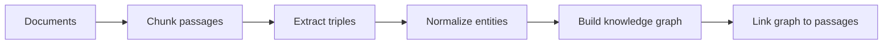
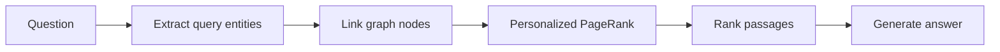

# Graph RAG

Graph-based retrieval-augmented generation for the Wiki Base workspace.

## Indexing



1. **Documents:** Load the source documents that will become the knowledge base.
2. **Chunk passages:** Split each document into small passages that can be retrieved as evidence.
3. **Extract triples:** Convert passage text into `(subject, relation, object)` facts.
4. **Normalize entities:** Clean entity names so equivalent mentions map to the same concept.
5. **Build knowledge graph:** Create entity nodes and connect them with the extracted relations.
6. **Link graph to passages:** Record which passages support each node and relation.

`HippoRAGIndexer` implements this flow for `IndexedChunk` inputs, pairing each
`DocumentChunk` with its document ID. Nodes and edges retain both document and chunk
provenance. Triple extraction is provided through the `TripleExtractor` protocol.
`LLMTripleExtractor` uses a structured generation provider such as
`OllamaGenerationProvider` to produce schema-constrained triples.

`KnowledgeGraph.merge(first, second)` combines independently indexed document graphs into
a new corpus graph without mutating either input. Duplicate facts and provenance are
deduplicated.

`GraphVisualizer` converts an indexed `KnowledgeGraph` into a NetworkX `MultiDiGraph`. It
can filter the shared graph by document provenance, serialize NetworkX node-link JSON, and
render interactive HTML with PyVis. The visual projection adds document nodes and dashed
`contains` edges for provenance; these visualization-only edges are not added to the
`KnowledgeGraph` used for retrieval.

Render an existing graph JSON file beside the source file:

```bash
uv run --package graph-rag graph-rag-visualize path/to/document-id.json
```

Merge all document graphs in a directory and render the combined graph:

```bash
uv run --package graph-rag graph-rag-visualize-merge path/to/graph-directory
```

The command writes `merged.json` and `merged.html` beside the source files. It also accepts
an explicit list of JSON files and an optional `--output path/to/name.json`.

## Retrieval



1. **Question:** Accept the user's question as the retrieval input.
2. **Extract query entities:** Identify the important entities and concepts in the question.
3. **Link graph nodes:** Match those entities to corresponding nodes in the knowledge graph.
4. **Personalized PageRank:** Spread relevance from the matched nodes through their graph connections.
5. **Rank passages:** Score and select passages associated with the most relevant graph nodes.
6. **Generate answer:** Ask an LLM to answer the question using the selected passages as evidence.

## Development

From the repository root:

```bash
uv sync --package graph-rag
uv run --package graph-rag python -c "import graph_rag"
```
