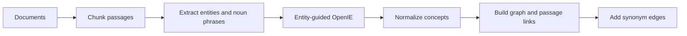
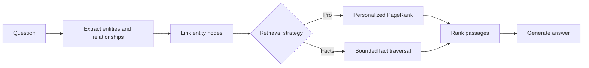

# Graph RAG

Graph-based retrieval-augmented generation for the Wiki Base workspace.

## Indexing



1. **Documents:** Load the source documents that will become the knowledge base.
2. **Chunk passages:** Split each document into small passages that can be retrieved as evidence.
3. **Extract passage concepts:** Identify named entities and meaningful noun phrases independently
   of relationship extraction.
4. **Entity-guided OpenIE:** Supply those concepts to triple extraction and produce
   `(subject, relation, object)` facts.
5. **Normalize concepts:** Clean entity names so equivalent mentions map to the same concept.
6. **Build graph and passage links:** Store factual edges plus every chunk that mentions a node,
   including concepts that produced no triple.
7. **Add synonym edges:** Connect high-confidence semantic aliases across ready document graphs.

`HippoRAGIndexer` implements this flow for `IndexedChunk` inputs, pairing each
`DocumentChunk` with its document ID. `LLMPassageEntityExtractor` performs the first pass,
and `LLMTripleExtractor` uses those concepts for schema-constrained OpenIE. Nodes retain
entity-mention and triple provenance separately, while edges retain supporting triples.
If a provider rejects one structured passage output as recoverable, indexing logs the
document and chunk, skips that extraction result without retrying, and continues.
Canonical graph version 2 serializes isolated entity mentions and remains able to read
version 1 edge-only graphs during migration.

`KnowledgeGraph.merge(first, second)` combines independently indexed document graphs into
a new corpus graph without mutating either input. Duplicate facts and provenance are
deduplicated.

`GraphVisualizer` converts an indexed `KnowledgeGraph` into a NetworkX `MultiDiGraph`. It
can filter the shared graph by document provenance and render interactive HTML with PyVis.
The NetworkX graph exists only in memory. The visual projection adds document nodes and
dashed `contains` edges for provenance. It also renders semantic synonym edges separately;
visualization-only document links are not stored in canonical graph JSON.

Render a document graph from PostgreSQL. By default, the HTML is written to the current
directory using the document ID as its filename:

```bash
uv run graph-rag-visualize <document-id>
```

Merge all ready document graphs belonging to a wiki base and render the combined graph:

```bash
uv run graph-rag-visualize-merge <wiki-base-id>
```

The merge command writes `<wiki-base-id>.json` and `<wiki-base-id>.html` to the current
directory. Both commands accept `--output path/to/name.html` or
`--output path/to/name.json`, respectively. The generated files are inspection artifacts;
the canonical document graphs remain in PostgreSQL.

## Retrieval



1. **Question:** Accept the user's question as the retrieval input.
2. **Extract query concepts:** Identify important entities and relationships in the question.
3. **Link graph concepts:** Match query entities to canonical graph nodes.
4. **Retrieve graph evidence:** Pro spreads relevance with Personalized PageRank. Facts follows
   bounded directed triples and scores them using query relationships and the complete question.
5. **Rank passages:** Project relevant nodes or facts through their chunk provenance.
6. **Generate answer:** Use selected passages and, in Facts mode, cited triples as evidence.

`LLMQueryEntityExtractor` implements query-concept extraction through the shared structured
generation provider. It returns validated entity and relationship lists without answering
the question.

`EmbeddingEntityLinker` resolves normalized exact matches first, then embeds unmatched query
entities and relationships to find semantic matches above a configurable threshold.
Entity aliases sharing a meaningful token receive a small lexical bonus while still passing
the final strict threshold. Relationship candidates connected to an already-linked query
entity are preferred over unrelated semantic matches, and named nodes mistakenly extracted
as relationships are treated as entities.
Semantic relationship matching uses the complete edge text—subject, relationship, and
object—so generic labels such as `offers` retain their fact context. A matched edge
contributes its subject and object nodes. Wiki Base persists graph concept embeddings and
supplies pgvector search to the linker, so candidate concepts are not re-embedded during
retrieval. Standalone use embeds and caches graph candidates in memory. Relationship linking
has its own lower threshold and uses shared meaningful terms to focus semantic comparison.

`build_ranking_graph` projects the knowledge graph into an undirected NetworkX entity graph.
Factual connections have weight `1.0`, persisted synonym connections use their similarity,
and visualization-only document nodes remain excluded.

`personalized_page_rank` distributes restart probability equally across linked query
nodes and ranks their connected entity neighborhoods. It returns no scores when the query
has no valid graph seeds.

`aggregate_chunk_scores` projects positive entity scores through both passage mentions and
triple provenance. The same node/chunk association counts once at equal default weights. It
returns deterministic `RankedChunk` results ordered by graph relevance.

`PageRankRetriever` composes query extraction, entity linking, the ranking projection,
Personalized PageRank, and chunk aggregation. It returns ranked document/chunk IDs and
does not depend on a database or chunk-content store.

`GraphFactTraverser` follows canonical directed facts from linked query nodes with bounded
depth and candidate counts. `FactRetriever` scores those facts against query relationships
and the complete question, preserves coverage across seeds, and ranks chunks through fact
provenance without running PageRank.

## Roadmap

See [OPTIMIZATIONS.md](OPTIMIZATIONS.md) for the prioritized retrieval improvements.

## Development

From the repository root:

```bash
uv sync --package graph-rag
uv run --package graph-rag python -c "import graph_rag"
```
