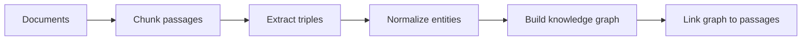
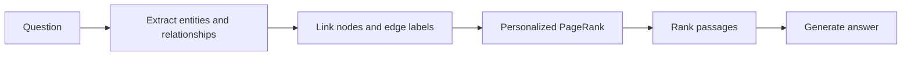

# Graph RAG

Graph-based retrieval-augmented generation for the Wiki Base workspace.

## Indexing



1. **Documents:** Load the source documents that will become the knowledge base.
2. **Chunk passages:** Split each document into small passages that can be retrieved as evidence.
3. **Extract triples:** Convert passage text into `(subject, relation, object)` facts.
4. **Normalize entities:** Clean entity names so equivalent mentions map to the same concept.
5. **Build knowledge graph:** Create entity nodes and connect them with the extracted relations.
6. **Link graph to passages:** Record which passages support each node and relation.

`HippoRAGIndexer` implements this flow for `IndexedChunk` inputs, pairing each
`DocumentChunk` with its document ID. Nodes and edges retain both document and chunk
provenance. Triple extraction is provided through the `TripleExtractor` protocol.
`LLMTripleExtractor` uses a structured generation provider such as
`OllamaGenerationProvider` to produce schema-constrained triples.

`KnowledgeGraph.merge(first, second)` combines independently indexed document graphs into
a new corpus graph without mutating either input. Duplicate facts and provenance are
deduplicated.

`GraphVisualizer` converts an indexed `KnowledgeGraph` into a NetworkX `MultiDiGraph`. It
can filter the shared graph by document provenance and render interactive HTML with PyVis.
The NetworkX graph exists only in memory. The visual projection adds document nodes and
dashed `contains` edges for provenance; these visualization-only edges are not stored in
canonical graph JSON.

Render a document graph from PostgreSQL. By default, the HTML is written to the current
directory using the document ID as its filename:

```bash
uv run graph-rag-visualize <document-id>
```

Merge all ready document graphs belonging to a wiki base and render the combined graph:

```bash
uv run graph-rag-visualize-merge <wiki-base-id>
```

The merge command writes `<wiki-base-id>.json` and `<wiki-base-id>.html` to the current
directory. Both commands accept `--output path/to/name.html` or
`--output path/to/name.json`, respectively. The generated files are inspection artifacts;
the canonical document graphs remain in PostgreSQL.

## Retrieval



1. **Question:** Accept the user's question as the retrieval input.
2. **Extract query concepts:** Identify important entities and relationships in the question.
3. **Link graph concepts:** Match entities to nodes and relationships to edge labels. A matched
   relationship contributes the subject and object of its matching edges as ranking seeds.
4. **Personalized PageRank:** Spread relevance from the matched nodes through their graph connections.
5. **Rank passages:** Score and select passages associated with the most relevant graph nodes.
6. **Generate answer:** Ask an LLM to answer the question using the selected passages as evidence.

`LLMQueryEntityExtractor` implements query-concept extraction through the shared structured
generation provider. It returns validated entity and relationship lists without answering
the question.

`EmbeddingEntityLinker` resolves normalized exact matches first, then embeds unmatched
entities, relationships, graph nodes, and edge labels to find semantic matches above a
configurable similarity threshold. Semantic relationship matching uses the complete edge
text—subject, relationship, and object—so generic labels such as `offers` retain their fact
context. A matched edge contributes its subject and object nodes. Node and edge embeddings
are cached and reused across retrieval requests. Relationship linking has its own lower
threshold and uses rare shared terms to focus semantic comparison on relevant facts.

`build_ranking_graph` projects the knowledge graph into an undirected, unweighted NetworkX
entity graph. It excludes visualization-only document nodes and collapses repeated
relations between the same entity pair into one associative connection.

`personalized_page_rank` distributes restart probability equally across linked query
nodes and ranks their connected entity neighborhoods. It returns no scores when the query
has no valid graph seeds.

`aggregate_chunk_scores` sums positive entity scores over document/chunk provenance and
returns deterministic `RankedChunk` results ordered by graph relevance.

`HippoRAGRetriever` composes query extraction, entity linking, the ranking projection,
Personalized PageRank, and chunk aggregation. It returns ranked document/chunk IDs and
does not depend on a database or chunk-content store.

## Roadmap

See [OPTIMIZATIONS.md](OPTIMIZATIONS.md) for the prioritized retrieval improvements.

## Development

From the repository root:

```bash
uv sync --package graph-rag
uv run --package graph-rag python -c "import graph_rag"
```
